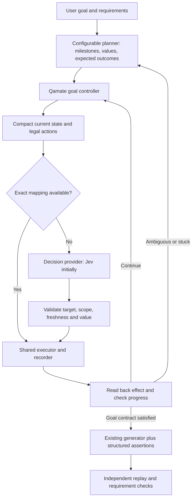

# Qamate: faster exploration and reliable test authoring with Jev

Reviewed: 19 September 2026. Design reference; runtime integration is now underway. See [implementation status](QAMATE_IMPLEMENTATION_STATUS.md) and the [20 September routing pilot](QAMATE_JEV_ROUTING_2026-09-20.md) for verified progress and remaining work.

## Decision

Add a bounded navigation controller inside Qamate. It should execute a meaningful goal through the existing Playwright, recording, provenance, and verification services. Use deterministic code for exact operations, Jev initially for ambiguous choices among observed actions, and a configurable generative model for planning, generating necessary text, and resolving unfamiliar situations.

**Product requirement: models and providers must be easy to replace. MiMo was selected only for testing; it is not a product dependency, prescribed planner, or implicit fallback.** Provider-specific transport and parameter handling belong behind adapters. Browsing, recording, exploration, and verification must work independently of the selected vendor. Jev also occupies a replaceable decision-provider role.

First improve the existing execution harness and measure it with a fixed reference planner. MiMo can be used to reproduce the historical test, without determining the product architecture. Then compare the hybrid controller against that improved baseline using the same planner. Otherwise we could attribute a gain from removing unnecessary waits to Jev, or integrate Jev into a harness that still targets the wrong element.

The first delivery is one complete vertical slice: login, sort inventory, add the specified product, assert the cart contents, generate the test, and independently replay it. Broader exploration and multi-app execution follow. App and actor identity belong in the contracts from the first slice.

## 1. What the current implementation actually does

The code already contains useful mechanisms: within-turn context compaction, native and custom dropdown handling, locator healing, record-time locator checks, value provenance, manual-input gates, pytest collection checks, a repeated verification loop, and an independent benchmark runner. Extend these mechanisms.

| Current finding | Why it matters | Change required |
|---|---|---|
| Every normal `fill` calls `get_options()`; an empty result triggers another call after 1.5 seconds. Each options lookup can wait 3 seconds plus a fixed 1 second. `_settle()` also waits for global network idle for up to 3 seconds. | A field with no autocomplete can incur approximately 9.5 seconds of options waiting, plus the settle time, before the next model call. This is a code-path finding, not a new timing benchmark. | Distinguish plain inputs, native selects, and autocomplete controls. Wait for the specific action outcome. |
| A click opening an overlay invokes the vision oracle automatically. | Even an ordinary DOM-readable menu can add another provider call and failure path. | Use the DOM result first; invoke a capability-checked visual fallback when observation is insufficient. |
| DOM capture combines `data-testid`, `data-test-id`, `data-test`, and `data-cy` into one `test_id`. The locator layer resolves it with `get_by_test_id`. | The original attribute identity is lost; different attributes are not interchangeable. This can send healing toward a label or another element. | Preserve the attribute name and value through observation, execution, and code generation. |
| DOM capture reads values and checked state, but `element_to_model` drops them. Native select options are not retained as structured option identities. | The controller cannot reliably know that a field is already correct or distinguish an option label from its underlying value. | Preserve the state needed to act and verify without another model call. |
| `inspect()` rebuilds a label-derived ref map; ARIA augmentation matches by names; action fallback may resolve another locator. | A ref is not proof of a current, correctly typed DOM target. | Add snapshot/document identity, real node grounding, action compatibility, and target validation. |
| `observe()` exposes at most 40 compact entries and collapses repeated controls within a region. | A relevant control can disappear; identical buttons on different records can lose their row context. | Keep the full local inventory and expose goal-relevant regions, entity context, and explicit expansion. |
| Context compaction already exists, but the broad agent prompt, tool schemas, and recent transcript still accompany repeated model requests. | Truncation alone does not remove the cost of one planning call per browser action. | Move the inner action loop into an aggregate goal tool with a small decision payload. |
| Agent model construction uses an OpenAI-compatible chat path, while extraction/synthesis has a separate provider registry and vision uses another call path. | A provider working for one task does not establish that it works across the product. Duplicated selection and defaults make replacement inconsistent. | Use a shared provider-profile resolver and role bindings across all model call paths, with explicit protocol adapters and capability checks. |
| `map_app` follows same-origin links and records some JS-navigation candidates. | Link discovery cannot fully explore modals, wizards, validation states, or dependent forms. | Add exploration of meaningful UI states and transitions, with a bounded coverage frontier. |
| Recorded steps are dictionaries with executable `rawLine` strings. Checkpoint truth checks are best effort and cover a limited subset. | Replaying an interaction is different from verifying its intended business outcome. | Extend the existing step format with structured effects and requirement-backed assertions. |
| `run_test_case` primarily interprets exit code and stdout; its shared `_agent_verify` directory is cleared per attempt. | Skips, variants, weak assertions, and concurrent sessions need stronger accounting and isolated evidence. | Use exact test identities and JUnit/checkpoint evidence; retain run-scoped artifacts. |
| Projects support an `apps` list, but startup resolves the first app and the authoring session has one main page/context. Generated fixture selection uses string heuristics. | Multiple configured URLs do not yet provide general cross-app authoring. Existing seller/admin replay fixtures are useful foundations. | Add explicit app/actor bindings and a context registry; generate steps against those bindings. |
| `_apply_login_state` writes every saved origin's local storage into the current origin; extra authoring states are matched by hostname. | Cross-origin or same-host/different-port sessions can be applied incorrectly. | Restore storage through the correct context and exact origin. |
| A terminal chat exception emits `error`; the benchmark turn loop stops on `turn_complete` or process exit. | A failed model request can leave the benchmark waiting until its outer timeout. | Emit and consume an explicit terminal result on every exit path. |

Code evidence:

- [Browser waits and normal fills](<C:/Users/DeveshYadav(Product)/Documents/Notes/2025/Agrim PRD/agrim-ats/engine/agent_chat.py:1733>), [options wait](<C:/Users/DeveshYadav(Product)/Documents/Notes/2025/Agrim PRD/agrim-ats/engine/agent_chat.py:1034>), [settle](<C:/Users/DeveshYadav(Product)/Documents/Notes/2025/Agrim PRD/agrim-ats/engine/agent_chat.py:938>), [overlay vision](<C:/Users/DeveshYadav(Product)/Documents/Notes/2025/Agrim PRD/agrim-ats/engine/agent_chat.py:2704>).
- [DOM capture](<C:/Users/DeveshYadav(Product)/Documents/Notes/2025/Agrim PRD/agrim-ats/engine/app_explorer.py:252>), [element conversion](<C:/Users/DeveshYadav(Product)/Documents/Notes/2025/Agrim PRD/agrim-ats/engine/app_explorer.py:85>), [locator resolution](<C:/Users/DeveshYadav(Product)/Documents/Notes/2025/Agrim PRD/agrim-ats/engine/smart_locator.py:72>), [compaction](<C:/Users/DeveshYadav(Product)/Documents/Notes/2025/Agrim PRD/agrim-ats/engine/normalizer.py:93>).
- [Agent compaction](<C:/Users/DeveshYadav(Product)/Documents/Notes/2025/Agrim PRD/agrim-ats/engine/agent_chat.py:169>), [inspection](<C:/Users/DeveshYadav(Product)/Documents/Notes/2025/Agrim PRD/agrim-ats/engine/agent_chat.py:1473>), [action resolution/recording](<C:/Users/DeveshYadav(Product)/Documents/Notes/2025/Agrim PRD/agrim-ats/engine/agent_chat.py:1673>).
- [Checkpoints](<C:/Users/DeveshYadav(Product)/Documents/Notes/2025/Agrim PRD/agrim-ats/engine/agent_chat.py:2210>), [test creation](<C:/Users/DeveshYadav(Product)/Documents/Notes/2025/Agrim PRD/agrim-ats/engine/agent_chat.py:2278>), [verification](<C:/Users/DeveshYadav(Product)/Documents/Notes/2025/Agrim PRD/agrim-ats/engine/agent_chat.py:3052>), [exploration](<C:/Users/DeveshYadav(Product)/Documents/Notes/2025/Agrim PRD/agrim-ats/engine/agent_chat.py:2353>).
- [App configuration](<C:/Users/DeveshYadav(Product)/Documents/Notes/2025/Agrim PRD/agrim-ats/engine/project_store.py:346>), [auth restoration](<C:/Users/DeveshYadav(Product)/Documents/Notes/2025/Agrim PRD/agrim-ats/tests/conftest.py:442>), [fixture generation](<C:/Users/DeveshYadav(Product)/Documents/Notes/2025/Agrim PRD/agrim-ats/engine/recorder_parser.py:1142>).
- [Terminal exception handling](<C:/Users/DeveshYadav(Product)/Documents/Notes/2025/Agrim PRD/agrim-ats/engine/agent_chat.py:4223>) and [benchmark event handling](<C:/Users/DeveshYadav(Product)/Documents/Notes/2025/Agrim PRD/agrim-ats/engine/agent_bench.py:417>).
- [Agent provider construction](<C:/Users/DeveshYadav(Product)/Documents/Notes/2025/Agrim PRD/agrim-ats/engine/agent_chat.py:3897>) and [extraction/synthesis provider registry](<C:/Users/DeveshYadav(Product)/Documents/Notes/2025/Agrim PRD/agrim-ats/engine/llm.py:168>).

Current baseline evidence:

- Both module self-tests passed in this review. The offline engine suite produced **217 passed, 1 failed**. The failing `test_run_test_once_pass` subprocess collects a parent Windows temporary directory and encounters an inaccessible socket (`WinError 1920`). Reproduced directly; fix synthetic pytest isolation before treating the gate as green.
- The checked-in [authoring task file](<C:/Users/DeveshYadav(Product)/Documents/Notes/2025/Agrim PRD/agrim-ats/engine/agent_bench_tasks.json:1>) currently contains **three** playwright.dev tasks. Earlier documentation describing ten tasks does not describe this checkout's current manifest. Check these tasks against current site semantics before freezing them.
- The [saved SauceDemo scorecard](<C:/Users/DeveshYadav(Product)/Documents/Notes/2025/Agrim PRD/agrim-ats/results/_agent_bench/2026-08-31_00-12-10/scorecard.json:1>) records 1,267.3 seconds, 33 tool calls, no delivered test, and 808,226 estimated input tokens. Provider-reported tokens were unavailable. This is historical evidence, not a fresh run or a general success-rate estimate.
- No live Jev performance or accuracy measurement has been made for Qamate in this review.

## 2. Jev's actual role and limits

The current documented version is `jev-1.13.0`. It accepts text/JSON and returns typed decisions; it cannot directly read screenshots or generate arbitrary strings. Keep image interpretation in the existing visual fallback and text generation in a generative provider. Pin the Jev version during evaluation and retain the returned version in traces. [Official model reference](https://docs.typesafe.ai/models)

Questions in one request share state but are evaluated independently. A `Choice` can contain up to 255 options. Use a composite executable action as the normal choice. At larger cardinalities, select a region or target before exposing that target's operations/options, or use operation-specific target questions with deterministic compatibility checks. Do not independently pick an arbitrary action, element, and value and assume the combination is valid. [State](https://docs.typesafe.ai/concepts/state), [Choice](https://docs.typesafe.ai/primitives/choice)

Confidence is derived from the distribution across choices. It is not the probability that the entire browser task will succeed. Calibrate acceptance thresholds on Qamate examples, separately by action family and model/question version; log selected probability, margin, confidence, and resulting outcome. A single eligible action is not automatically justified merely because its probability is high. [Confidence](https://docs.typesafe.ai/confidence)

Keep counting, arithmetic, prices, date comparisons, exact IDs, sorting, and equality checks in code. TypeSafe also documents weaknesses around large irrelevant state, indirection, adversarial content, and consistency between separately asked questions. Candidate restrictions must come from trusted task scope and code; page content supplies observations. [Documented model limitations](https://docs.typesafe.ai/model-jaggedness/jev-1.13)

## 3. Architecture inside the existing system



### A. Replaceable model and provider layer

Separate **provider profiles**, **model capabilities**, and **task roles**. A normal installation can use one generative profile for all text tasks and Jev for decisions; separate specialist models are optional.

| Configuration | Purpose |
|---|---|
| Provider profile | Named connection: adapter/protocol, endpoint, model ID, secret reference, timeouts, retry policy, and validated provider-specific parameters. Multiple profiles may use the same vendor or endpoint. |
| Capabilities | Native tool calls, structured output, text generation, vision, streaming, context/output limits, and available usage reporting. Separate model capability from API-protocol compatibility. |
| Role bindings | `planner`, `authoring`, `extraction`, and `recovery` inherit the selected primary profile unless overridden. `decision` selects Jev or another decision adapter. `vision` is optional and requires image support. |
| Selection precedence | Application defaults, then project overrides, then explicit session overrides. Persist the resolved profile/model IDs with the session and evaluation artifacts. |

For an API that implements an existing supported protocol, adding or replacing a model should be a Settings change: endpoint, model ID, key, and appropriate capabilities/parameters. For a different API protocol, add a small adapter implementing the same internal contract; the browser controller, test generator, and verification code should not change. A new model ID must not require a hardcoded application release.

Use one shared resolver/factory for the conversational agent, requirement extraction, text generation, and visual fallback. Reuse the existing agent framework and provider implementations where appropriate. Normalize messages, tool schemas/calls/results, structured outputs, usage, cancellation, and errors at the boundary. Keep provider-specific headers, reasoning controls, token-limit parameter names, and unsupported options inside the adapter.

Where a model lacks native tool calling or schema enforcement, support a bounded structured-action response through an adapter and validate it before dispatch. If it cannot reliably satisfy the role's minimum contract, report that role as unsupported. Connectivity alone is not proof of browsing or authoring capability, and syntactically compatible APIs need contract tests.

Keep the decision contract separate from generative chat. An LLM-backed decision adapter may choose from the same legal candidates, but it must not fabricate Jev-style calibrated probabilities. Unavailable uncertainty fields remain absent, and acceptance policy is evaluated per adapter/model. Disabling Jev leaves the generative execution path available; fallback routing must be explicitly configured and traceable.

Keep prompts and saved task state independent of vendor/model names. Change a session's role binding at a safe goal boundary, with no browser effect in flight; reconstruct provider input from normalized history or a bounded task handoff. Preserve goals, captured values, provenance, recording, and verification status. Do not replay completed actions merely because the model changed.

Settings should offer saved profiles, a primary-model selector, optional role overrides, and a connection/capability check. Preserve the existing secret store; never require credentials in prompts, exported projects, or generated tests. Normalize authentication, quota/rate-limit, unsupported-capability, context-limit, timeout, and malformed-response errors so the controller can respond consistently. Missing provider usage or pricing remains unknown or explicitly estimated.

Acceptance: swap model IDs within one compatible endpoint, swap endpoints using the same adapter, and switch to a second protocol adapter using configuration only. Run planning, goal execution, extraction, authoring, and optional vision checks through the resolved roles. Verify unsupported capabilities are handled explicitly, no provider-specific assumptions reach browser logic, and recorded tests replay without the model used to author them. Use deterministic fake-provider contract tests plus live checks for each declared supported adapter when credentials are available; mark any untested live integration clearly.

### B. One shared execution service

Extract a small service around the existing tool wrappers. Both ordinary agent tools and the new controller call it. Calling `BrowserSession.act()` directly from a new loop would bypass `_value_gate`, input-registry updates, manual-input behavior, events, and some recording logic.

Preserve the single browser thread: all Playwright objects remain owned by `_BROWSER`. Provider requests run outside it. Browser mutations are serial; cancellation and page changes invalidate pending decisions. The initial implementation does not need a replacement browser runtime or an async Playwright migration.

### C. Goal-level execution

Expose a tool conceptually shaped as:

```text
execute_goal(goal, app_id, actor_id, values, expected_outcomes, scope, budget)
```

The controller performs several actions and local waits before returning a compact result to the configured planner. The planner is invoked for initial planning, relevant milestone changes, missing generative information, or bounded recovery. Avoid wrapping each Jev decision in another generative-model tool round trip.

Split tools by task phase where supported: planning/context tools, the goal executor, authoring/verification tools, and a small recovery set. Large settings, file, or history payloads should be retrieved only when the task needs them.

The public result distinguishes `completed`, `needs_input`, `needs_planner`, `stuck`, `unsupported`, `budget_exceeded`, `cancelled`, and `error`. Evidence distinguishes action execution, field readback, goal verification, and independent replay. A provider's `done` opinion cannot promote a run to verified.

Implement Jev as a separate decision-provider interface, not as an entry that must satisfy the existing generative chat-provider contract. Use the official Python SDK behind that adapter, reuse its client, and set one bounded retry policy. Read `TYPESAFE_API_KEY` in the engine process through the existing secret/configuration mechanism. The initial access check uses a small synthetic decision without app data. Missing access leaves the current engine available and is reported explicitly; no benchmark may silently substitute another provider and label the result Jev.

### D. Minimal typed contracts, compatible with existing recordings

Use validated Python types around the existing dictionaries. Add fields rather than requiring a wholesale conversion of old recordings.

| Contract | Essential fields |
|---|---|
| Goal | goal ID, app/actor, entry state, allowed effects, supplied value IDs, expected outcomes with sources, budgets |
| Observation | snapshot/document/page IDs, exact origin and route, relevant regions and records, controls and capabilities, values/options, errors, readiness |
| Action candidate | candidate ID, snapshot/page/app/actor binding, operation, grounded target ID, optional value ID, preconditions, anticipated effect |
| Action outcome | attempt ID, resolved target/locator, dispatched state, observed effect, failure class, timings, evidence |
| Recorded step | existing fields plus schema version, app/actor/page, structured locator, value binding, readiness condition, capture bindings, checkpoint links |

Live refs are ephemeral. Persist durable locator recipes and entity context for replay, never a snapshot ref. Record the locator and operation that actually executed. When healing changes the target identity or loses entity context, stop and re-ground.

Example choices for one current state:

```text
select:inventory_sort:price_low_to_high
click:product_onesie:add_to_cart
open_region:cart
wait:inventory_loaded
inspect_region:product_list
escalate:missing_target
```

These are explanatory names; the provider receives descriptions with enough local meaning, and code maps validated response IDs to private executable objects. Credentials and other secret values are represented by opaque local bindings, including in persisted traces and generated tests.

### E. Better observations and candidates

Capture the primary DOM inventory atomically. Keep actual node identity, original test attribute, tag, accessible/associated labels, input type, checked/current value, and native option `{label, value, disabled, selected}` data. Use accessibility augmentation when needed, without substituting a label node for a control merely because their text matches.

Keep the complete inventory locally; construct a small, self-contained decision frame for Jev with the current subgoal, relevant page facts, candidate descriptions, and recent outcomes. State diffs help Qamate avoid redundant work and reduce planner summaries, but a stateless Jev request still needs sufficient current context. Do not send a bare diff whose base exists only in a previous request.

Retain repeated-row identity: button plus product/order/customer context. Provide explicit region expansion, pagination, and inner-scroll actions when the target is absent. Do not hide unsupported controls behind an apparently complete observation. Preserve meaningful route/query state while excluding volatile timestamps and animation noise from progress comparisons.

Aim initially for 2–4k tokens per routine Jev request, as a measured target rather than a hard truncation limit. Prioritize candidate recall over saving the final few hundred tokens. For long option lists, resolve exact supplied labels/values locally; use hierarchical semantic selection only when needed.

Before dispatch, validate document/page identity, target attachment, operation capability, ownership/context, value provenance, and actionability. Changes to unrelated decorative content should not force a new decision. Changes affecting the chosen target or its preconditions should.

### F. Inputs and forms

Use supplied values, project data, observed options, and captured prior results. Preserve GUIDED/AUTO behavior and assumptions; centralize these gates so both engines behave consistently. Resolve secrets locally. Generate a missing non-secret value only when the task and current mode permit it; generate reusable form values together where practical.

Batch independent field-binding judgments in one Jev request, check collisions and form ownership, then fill serially with local readback. Re-observe dependent controls after an upstream field changes; a vendor → address → item form cannot be treated as independent fields. Include empty strings, zero, false, and explicit clearing correctly in the typed value format.

An executable action may intentionally enter invalid business data for a negative test. Capability filtering must not silently remove the invalid inputs the test is meant to exercise.

### G. Progress, waits, recovery, and provider failures

- Replace universal network-idle and options waits with operation-specific readiness/readback. Poll pending UI changes locally without repeated model calls. A changed DOM alone is not proof of goal progress.
- Track a semantic failure key: app, actor, meaningful state, goal, target identity, operation, and intended value. Renaming the ref or changing a locator string must not reset the counter.
- After two equivalent failures without meaningful progress, prohibit another equivalent attempt. Permit a bounded alternative recovery, then return a structured blocker to the configured recovery model. Detect short navigation cycles as well as repeated identical actions.
- Each goal has its own deadline, maximum browser actions, decision calls, provider spend, and planner escalations. An aggregate tool must not hide hundreds of operations behind one existing tool-budget unit.
- Distinguish not-dispatched, dispatched-but-unconfirmed, observed success, and failure. Record dispatch before observing. An uncertain form submission requires readback/reconciliation before any retry; switching providers must not repeat it automatically.
- Use one owner for inference retry policy, with connection reuse, bounded timeouts/backoff, and cancellation. Invalid credentials, unsupported models, and invalid request schemas terminate the affected path promptly. Transient inference retries do not replay browser effects.
- Check configured provider/model capabilities at startup and disable unavailable fallback tools. Separate a failed optional visual capability from a failed main planner.

## 4. Exploration and automatic test creation

### Exploration should build reusable evidence

Extend the current UI map into a graph of app/actor-scoped states and observed transitions. A state includes meaningful route, region, form/modal/wizard stage, entity context, and relevant values. Merely counting URLs will miss important behavior inside one SPA route.

Start from requirements and known entry points. Track a frontier of unexplored routes, tabs, dialogs, control types, validation outcomes, and workflow branches. Prioritize requirements and untested outcomes using code and occasional calls to the configured planner; the decision provider handles the local interaction choices. Deduplicate equivalent states and stop when coverage targets or budgets are reached.

Store graph facts with evidence and freshness. Reuse routes, stable locator recipes, and successful interaction patterns after validation. Separate discovery actions and failed recovery attempts from the final clean test recording. Known paths can become deterministic navigation helpers after successful replay.

### Test correctness needs an independent expected outcome

For each candidate test, record scenario, source requirement, preconditions, inputs, expected outcomes, cleanup/reset, and coverage links. Use the existing `extract_flows` tool as the starting point. When no requirement exists, label the test as checking observed behavior; do not claim an inferred business rule is specified behavior.

Lock expected outcomes before execution. Map them to structured assertions over exact entities: selected value, field contents, visible record, URL, count, numeric order, status, or captured ID. Keep comparisons and calculations deterministic. If the app contradicts a requirement, preserve the failed expectation and report the defect; never make a test green by weakening or deleting its central assertion.

For the SauceDemo pilot, selecting the sort label is insufficient. Parse displayed prices and verify ascending order; capture the specified product identity; verify the cart contains that product and quantity. A generic success toast is insufficient evidence of a saved record in the CRM pilot.

Compilation should reuse `generate_from_review`. Gradually replace fragile `rawLine` inference with structured steps where needed. Old test files remain runnable. The final flow must reproduce from a fresh context, retain manual-input gates, and resolve values through fixtures/captures rather than saved secrets or expired OTPs.

Verification must match the intended test and variants, inspect JUnit/checkpoint results, and reject all-skipped, missing-test, or missing-required-assertion results. Keep the two-run default, with independent benchmark replays separate from the agent's own verification. Isolate evidence by session, task, attempt, and replay; retain failures for diagnosis.

## 5. Multi-app execution

Introduce stable `app_id`, `actor_id`, exact allowed origins, and auth-profile references in the schema early. Migrate existing `apps` entries lazily with stable persisted IDs; preserve legacy project/seller/admin behavior. Reordering apps must not reassign identities, and sanitization must retain new fields.

Add a session registry keyed by actor and auth profile, with explicit app/page mappings. Isolate different users, including different users of the same origin. Share contexts for intentional same-actor SSO only when configured. Restore storage by exact origin; a hostname alone is insufficient.

The planner describes a cross-app workflow as steps and dependencies. The controller executes the next ready step and waits for specified outcomes. Capture IDs from trusted page/API evidence and bind them to later steps; do not correlate records by row order or a generic toast.

```text
Admin creates a test purchase order
    → capture order_id and vendor_id
Seller opens that exact order_id
    → accept the order
Admin waits, within a bounded propagation window
    → verify the same order_id has the expected status
```

Generate explicit app/actor page bindings for replay instead of guessing from the word `admin` in a URL or recorded line. Add per-app screenshots, network records, and traces to one run timeline. Use fresh contexts and isolated/resettable data for repeated verification.

Test authorization is set by the requested scenario and selected environment. Form saves, approvals, rejections, and deletion can be legitimate tests in an authorized test environment; do not introduce a blanket confirmation prompt on every submit. Exploratory runs on shared public sites remain within their permitted effects. The decision model cannot expand that scope.

## 6. Implementation sequence and exit gates

Each phase is a reviewable change with evidence. Use a separate execution-engine setting (`legacy` / `hybrid`), independent of the existing GUIDED/AUTO value mode. Shadow evaluation is a development setting.

| Phase | Concrete deliverable | Exit gate |
|---|---|---|
| 0. Trustworthy baseline | Fix synthetic test collection scope; inventory model call paths and capability requirements; add per-phase timing and per-provider usage; finalize all terminal outcomes; isolate verification artifacts; freeze baseline task definitions. | Offline gate green. Forced model failure finalizes promptly with preserved usage/evidence. Baseline manifest, resolved profiles/model versions, and outcomes recorded. |
| 1. Faster, correctly grounded harness | Shared action service; attribute/native-select identity; current value/options; targeted waits; optional vision; freshness checks; equivalent-failure breaker. | Local browser regressions pass without any model. Plain text inputs perform no autocomplete wait. Exact SauceDemo control works deterministically and generates replayable steps. |
| 2. Model layer and Jev pilot | Shared provider-profile resolver and role bindings; replaceable generative/decision adapters plus Jev implementation; typed action/state contracts; bounded `execute_goal`; compact payloads; secret/value bindings; feature flag. | Profile/model swaps work through configuration, with adapter contract tests and explicit capability handling. Shadow corpus assessed for candidate recall and acceptable actions. Live login → sort → product → cart pilot satisfies deterministic assertions and two independent replays. |
| 3. Forms and useful tests | Batched field bindings, dependent fields, goal assertions, scenario/requirement provenance, clean recordings, robust verification statuses. | CRM and negative-test pilot succeeds; planted wrong results are caught; no false verified result in the release fixtures. |
| 4. Exploration | State/transition graph, coverage frontier, requirement-directed scenarios, deduplication, validated path reuse. | New relevant states/outcomes discovered per minute improves; duplicate test generation falls; declared requirement coverage has linked assertions. |
| 5. Multi-app | Context registry, stable app/actor settings, exact-origin auth, captured IDs, propagation waits, explicit multi-page code generation. | Isolated two-app create → update → observe workflow replays; wrong-record and delayed-propagation controls fail correctly; no auth crossover. |
| 6. Rollout | Calibrated thresholds per decision adapter/model, developer shadow mode, opt-in hybrid sessions, comparative scorecards by planner profile, UI model selection/progress/usage, stable default selection. | Held-out suite meets the quality gates below; provider replacement and rollback tested; existing manually authored suites and GUIDED/AUTO behavior remain compatible. |

Suggested implementation boundaries:

- Extend existing observation/locator modules and `BrowserSession`; avoid a broad extraction of the entire agent file.
- Add focused modules for shared provider-profile resolution, role bindings, the shared action service, decision adapter/contracts, navigation controller, outcome checks, and later exploration/context management. Keep modules grouped by responsibility; names can follow repository conventions during implementation. Consolidate model selection across `agent_chat.py`, `llm.py`, and vision instead of introducing a fourth independent provider registry.
- Update `agent_chat.py` for tool integration and terminal lifecycle; `agent_bench.py` / `agent_eval.py` for measurements and verification; `recorder_parser.py` / fixtures for typed recording and cross-app replay.
- Extend `main.js`, `preload.js`, shared `agent_ui.js`, and settings for provider profiles/role bindings, engine selection, app/actor configuration, progress, and usage. Migrate existing `llm.providers` / `default_provider` settings compatibly. Keep mirrored session/context paths synchronized.
- Maintain Windows constraints: pinned Playwright thread, ASCII-safe NDJSON, subprocess `stdin=DEVNULL`, hidden child windows, and tracing owned by the current fixtures.
- Keep `engine/tests` offline. Put local browser fixtures and browser integration checks in a separate suite so the current fast quality gate does not acquire Chrome, network, or provider dependencies.

## 7. Evaluation design

### Compare three configurations

1. **A: current system + reference planner** — frozen starting revision and provider/model settings.
2. **B: improved harness + the same reference planner** — isolates gains from waits, grounding, recovery, and observation changes.
3. **C: same improved harness + Jev controller + the same reference planner** — measures the additional value of Jev.

MiMo may be the first reference planner solely to reproduce the earlier experiment. Repeat B/C on a second configurable planner, and exercise at least two API protocols before claiming provider-independent support. Keep planner/model settings fixed within each comparison; report quality, latency, tokens, and cost by resolved profile rather than blending providers into one headline. The compatibility requirement concerns replaceability; different models are still expected to have different accuracy and speed.

Do not use the old timeout as the sole baseline. Use the same task contracts, reset data, starting auth state, browser version/viewport, model settings, wall-clock budgets, and replay count. Alternate run order. Report failure and timeout attempts, not only successful runs. Compare speed on paired completed tasks as well as total capped time across all attempts.

Shadow evaluation has two parts: reusable captured observations for fast tuning, and sampled live observations for drift checks. Record a set of acceptable actions per state where several choices can succeed. Agreement with the reference planner is a diagnostic, not ground truth. Shadow results cannot prove how Jev behaves after following its own choices; the live phase is mandatory.

### Benchmark set

Start with 12 end-to-end tasks across controlled browser fixtures, SauceDemo, and a realistic CRM. Expand to 30 tasks: 8 harness/edge-case tasks, 6 storefront tasks, 8 CRM tasks, 4 Agrim regression tasks, and 4 multi-app tasks. Reserve 10 stratified tasks from tuning; complete and freeze that split before using the suite for a release decision. Use three authoring runs per task for the comparative gate, with the same independent replay protocol in each arm.

- **Controlled fixtures:** native select attribute variants, duplicate row actions, portal/ARIA ownership, inner scrolling, dependent fields, asynchronous validation, stale DOM targets, and session expiry. Include expected-blocker cases with explicit verdicts.
- **Storefront:** pinned local [Sauce Labs sample app](https://github.com/saucelabs/sample-app-web) for repeatability and a bounded public SauceDemo smoke for drift. Include the exact historical failed scenario; use local data for mutating checkout tests.
- **Business UI:** pinned local [Atomic CRM](https://github.com/marmelab/atomic-crm), covering contacts/companies, filtering, related-record selection, and create/edit/readback. Its local setup uses Supabase and Docker; check availability during phase 0 and provision it as a benchmark dependency. Shared public demo state is not a reproducible release baseline.
- **Existing Agrim tests:** selected catalog and order flows with explicitly scoped test records and cleanup.
- **Cross-app:** two controlled apps with shared backend records, deliberately delayed propagation, two roles, and exact correlation IDs; follow with the authorized Agrim seller/admin workflow.

The agent uses the UI under test. Fixture reset and independent ground-truth checks stay in the evaluator; do not hand hidden answers or privileged backend state to the browsing agent.

### Release criteria

These are proposed engineering targets, not measured Jev performance promises.

| Dimension | Target / rule |
|---|---|
| Independently replayable authoring | At least 90% on the supported task suite, with no regression on mandatory historical cases; report counts by family and uncertainty across repeats. |
| False verified results | Zero observed on planted wrong-result, skipped-test, stale-record, and wrong-app fixtures. This finite test result is not a universal guarantee. |
| Browser control | Zero capability/identity violations in local fixtures; candidate recall and accepted-action precision reported separately from full-task success. |
| Speed | Target at least 2× median authoring-speed improvement for C against B on paired completed tasks, while preserving replay checks; report p95 and separate app/network/replay time. |
| Tokens | Target at least 70% fewer total input tokens per successfully verified test than B using the same reference planner; report each generative and decision profile separately, including failures and retries. |
| Cost | Report total actual provider cost / independently verified test, plus estimated values clearly labeled when provider usage is absent. Do not infer spend from token counts across differently priced providers. |
| Stalls | Never exceed two equivalent unsuccessful attempts without a changed recovery path; all goal/run budgets terminate explicitly. |
| Test meaning | Every required expected outcome maps to an assertion and evidence; navigation-only checks cannot satisfy a business-outcome task. |
| Multi-app | Exact record correlation, no cross-actor auth leakage, bounded waits, and correct failure on wrong or absent downstream changes. |
| Model replacement | Model/endpoint/profile swaps require configuration only for supported adapters; new protocols require adapter changes only. Existing recordings and deterministic replay remain independent of the authoring model. |

Set action acceptance thresholds from observed risk-versus-coverage curves on tuning data, then lock them for held-out evaluation. Do not choose one arbitrary confidence threshold for every action or carry thresholds untested between decision adapters/models. Low acceptance coverage is a useful failure signal: a hybrid system that frequently returns to its generative planner may be accurate but offer little speed benefit.

Collect per-decision observation, candidates, selected ID, probabilities, provider latency/usage, dispatched effect, readback, failure class, and recording output, with secrets redacted. Track browser calls, local wait time, duplicate states, recovery calls, planner escalations, assertion failures, and independent replay outcomes.

## 8. What to learn from open source

Use source patterns selectively, with license notices for copied code. None of the reviewed Jev repositories establishes general Qamate reliability.

| Source | Useful pattern | Adaptation for Qamate |
|---|---|---|
| [browser-use/jev-ultrafast](https://github.com/browser-use/jev-ultrafast) | Atomic observations, grounded actions, target freshness, concise decision loop. Its published speed evidence is a small task sample. | Reuse the mechanics and measurement discipline. Preserve Qamate's input provenance and replay recording; independently check outcomes. |
| [tontoko/jev-browser goal runtime](https://github.com/tontoko/jev-browser/blob/main/docs/goal-runtime.md) | Goal-level form handling, field readback, option ownership, explicit verification status, and no blind retry of uncertain saves. | Best reference for `execute_goal`, forms, and result contracts. |

The Browser Use implementation already uses operation-specific target questions, so independent questions are not inherently unusable. The requirement is that code permits only compatible combinations. Start with composite choices for simplicity and evaluate more compact decompositions only when cardinality/latency warrants them. [Decision implementation](https://github.com/browser-use/jev-ultrafast/blob/main/jev_ultrafast/model.py)

Playwright already provides actionability checks and web-first assertions. Retain them when optimizing waits. Avoid substituting fixed tiny delays for readiness on slow enterprise applications. [Playwright auto-waiting](https://playwright.dev/python/docs/actionability)

## 9. First implementation milestone

Deliver phases 0–2 as one bounded pilot, split into reviewable changes:

1. A green offline gate and trustworthy timing/usage/terminal reporting.
2. Correct native/select/attribute grounding and fast plain-input execution through the shared service.
3. Configurable provider profiles and role bindings, plus a flagged Jev goal controller with escalation to the selected generative model and preserved recording/value gates.
4. A comparison of A/B/C on the exact SauceDemo workflow and representative local controls, plus model-replacement contract checks.
5. The generated test, deterministic assertions, and independent replay artifacts.

Proceed to broader forms and exploration when that pilot demonstrates both reliable outcomes and lower overhead. Use its measured bottlenecks to refine budgets and thresholds. Keep multi-app IDs in the contracts from this milestone, then implement the context registry and cross-app workflow after single-app behavior is stable.
